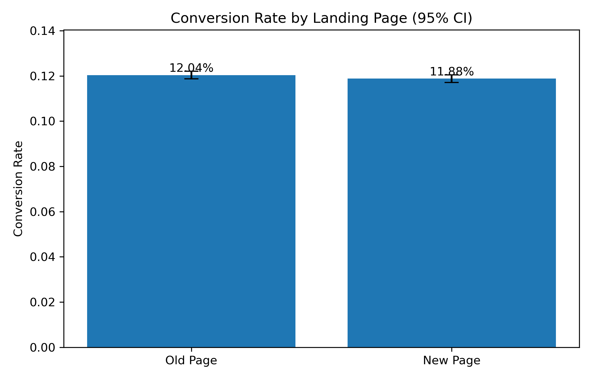
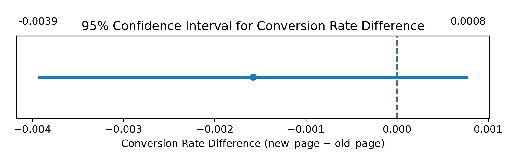

# Evaluating Website Redesign Impact with A/B Testing

## Project Overview

This project presents a data-driven evaluation of a website redesign using A/B testing, with the goal of assessing whether the redesigned landing page leads to a meaningful improvement in user conversion rates. The analysis follows industry-standard experimental and statistical practices to support evidence-based product decision-making.

The outcome of this project demonstrates how statistical rigor, uncertainty quantification, and practical significance should jointly inform product rollout decisions.

---

## Business Problem

A redesigned landing page was introduced with the expectation that it would improve user conversion rates. Before rolling out the redesign to all users, an A/B experiment was conducted to compare the performance of:

- **Control group:** Existing (old) landing page  
- **Treatment group:** Redesigned (new) landing page  

---

## Dataset

- **Source:** Kaggle — A/B Testing Dataset  
- **Observations:** ~290,000 user sessions  
- **Key variables:**
  - `group` — control vs treatment assignment
  - `landing_page` — old_page vs new_page
  - `converted` — binary conversion outcome (0/1)

Only clean, valid experimental observations were retained to ensure correct group–page alignment.

---

## Methodology

The analysis was conducted using the following structured approach:

1. **Data validation and experiment hygiene**
   - Removal of mismatched group–page assignments
   - Verification of balanced group sizes

2. **Descriptive analysis**
   - Conversion rates by landing page
   - Absolute and relative differences

3. **Statistical inference**
   - Two-proportion Z-test
   - 95% confidence interval for the difference in conversion rates

4. **Practical significance assessment**
   - Effect size estimation using Cohen’s *h*

5. **Visual communication**
   - Conversion rate comparison with confidence intervals
   - Confidence interval plot for the conversion rate difference

---

## Key Results

- The redesigned landing page shows a **slightly lower conversion rate** compared to the existing page.
- The two-proportion Z-test finds **no statistically significant difference** at the 5% significance level.
- The 95% confidence interval for the conversion rate difference includes zero, indicating that no effect or small effects in either direction are plausible.
- The estimated effect size (Cohen’s *h*) is **negligible**, suggesting no meaningful practical impact.

---

## Visual Summary

### Conversion Rate Comparison

### Conversion Rate Difference (95% Confidence Interval)

These visuals reinforce the statistical findings and highlight the uncertainty surrounding the observed difference.

---

## Conclusion and Recommendation

Based on the combined evidence from descriptive analysis, hypothesis testing, confidence intervals, effect size estimation, and visual summaries, there is no support for adopting the redesigned landing page in its current form.

The experiment provides no statistically significant improvement in conversion rate, and the estimated effect size indicates that any true difference is practically negligible. It is therefore recommended that the redesign not be rolled out and that future experiments explore alternative design changes with greater potential impact.

---

## Tools and Technologies

- Python
- pandas, NumPy
- statsmodels, SciPy
- Matplotlib
- Jupyter Notebook

---
